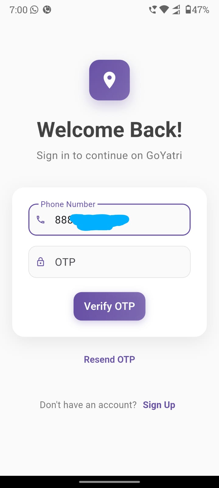

# Goyatri

Goyatri is a cross-platform Flutter application for transportation selection and location management, built with a clean architecture. It supports both Android and iOS.

## Features

- Select pickup location via search, recent, favorite, or map
- View/manage recent and favorite locations
- Use current GPS location for pickup
- Map-based location selection with custom markers
- Draw paths on map using polylines
- Firebase authentication and notifications
- Modern UI (Material Design)

## Demo Screenshots

| Home Page                          | Login Page                           | Menu Page                          |
| ---------------------------------- | ------------------------------------ | ---------------------------------- |
|  |  |  |

| Notification Alert                                  | Pickup Page                            | Select Location on Map                                     | Splash Page                            |
| --------------------------------------------------- | -------------------------------------- | ---------------------------------------------------------- | -------------------------------------- |
|  |  |  |  |

## Tech Stack & Packages

- **Clean Architecture**: Organized by feature, core, services, storage
- **GetX**: Navigation
- **Provider**: State management/controllers
- **permission_handler**: Request location permissions
- **google_maps_flutter**: Map integration
- **flutter_polyline_points**: Draw paths on map
- **Custom Markers**: For map locations (see `assets/icons/`)
- **firebase_core & firebase_auth**: Authentication
- **flutter_local_notifications**: Local notifications

## Folder Structure

```
lib/
  main.dart
  features/
    location/
      data/
      domain/
      presentation/
    ...
  core/
  services/
    notification_service.dart
  storage/
assets/
  icons/
  map/
  ...
android/
ios/
web/
windows/
linux/
macos/
test/
```

- **assets/**: Images, icons, custom map markers
- **features/**: Feature modules (location, routes, etc.)
- **core/**: Core utilities
- **services/**: Service classes
- **storage/**: Persistence

## Usage

- Search/select pickup location
- Use current location (with permission)
- View recent/favorite locations
- Select location on map (custom markers, polylines)
- Auth via Firebase
- Receive notifications

## Releases

APK releases are automatically generated when version tags are pushed to the repository. To create a new release:

1. Update the version in `pubspec.yaml`
2. Create and push a git tag (e.g., `git tag v1.0.1 && git push origin v1.0.1`)
3. GitHub Actions will automatically build the APK and create a release with the APK attached

## Contributing

Contributions are welcome! Please open issues or submit pull requests for improvements.

## License

This project is licensed under the MIT License.

## Note

**Important:** Do not use the API key included in this repository. It has been deactivated for security reasons. Please use your own API key for any integrations.
